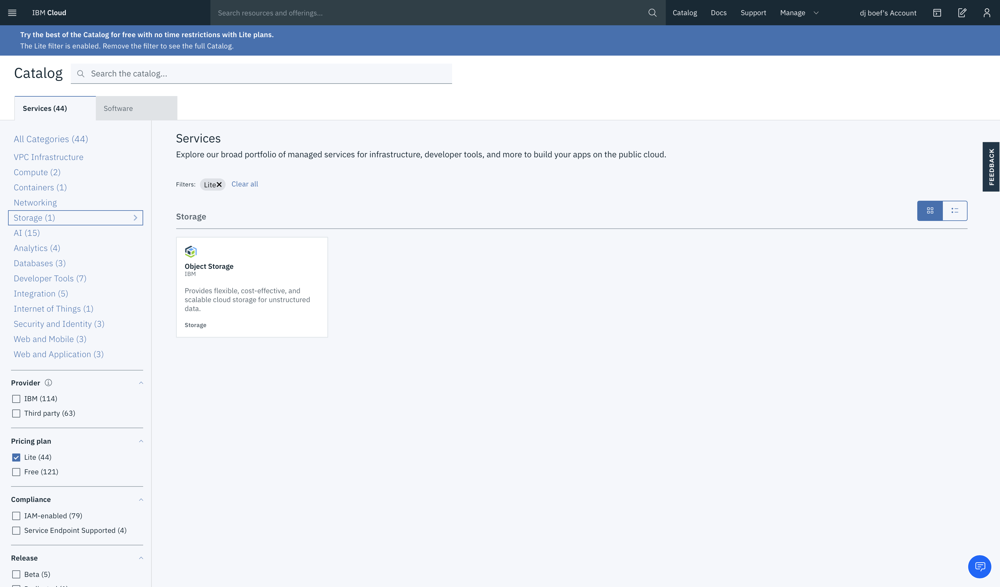
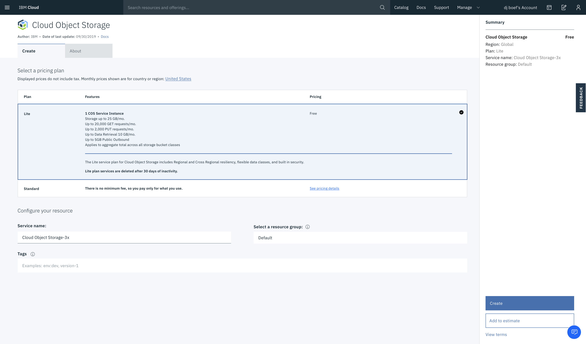
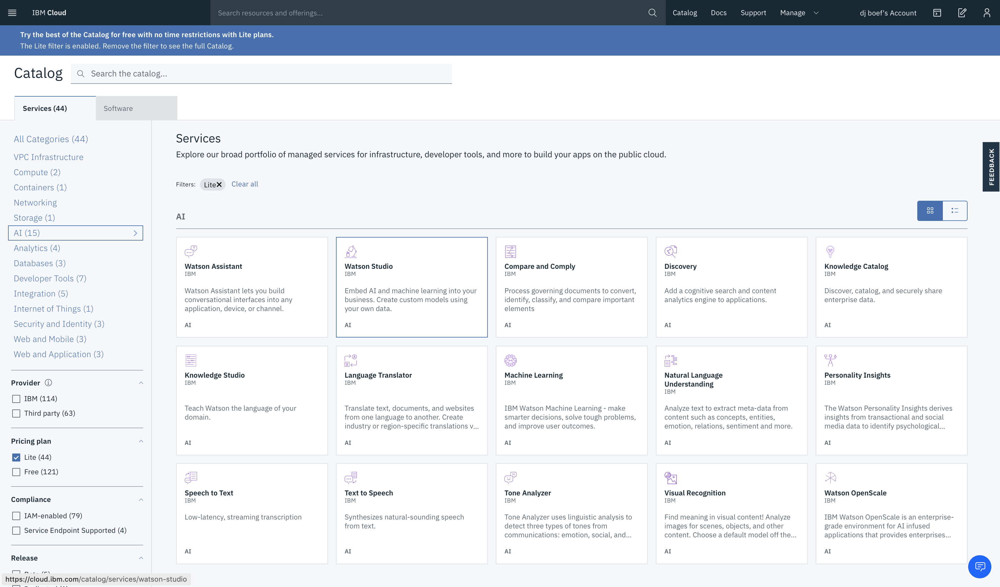
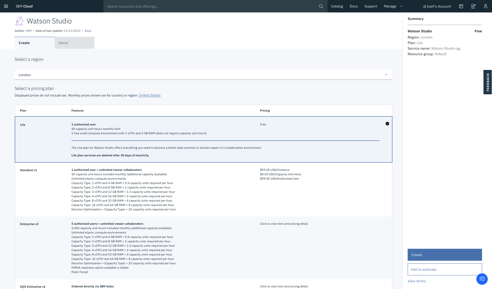
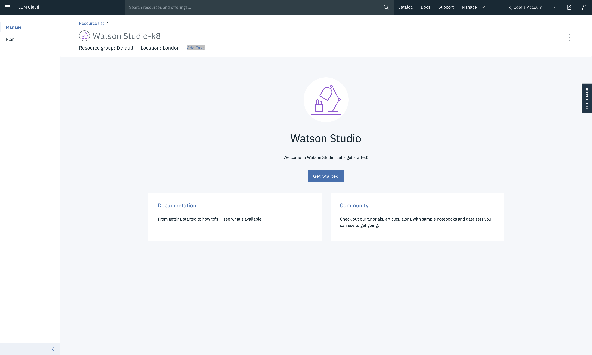
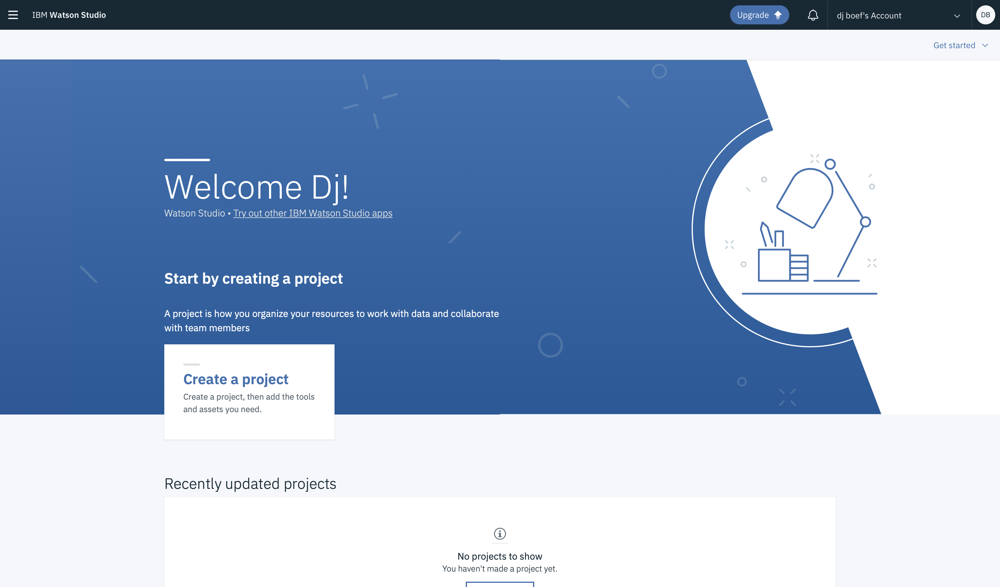
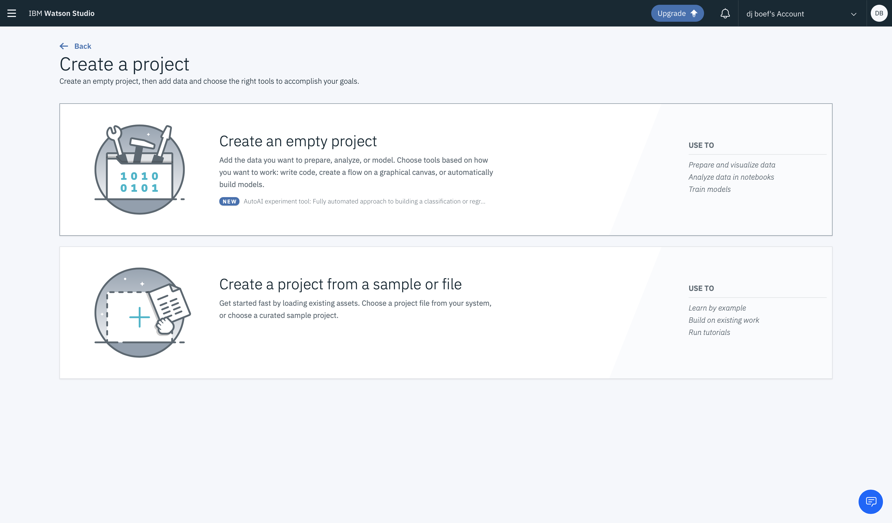
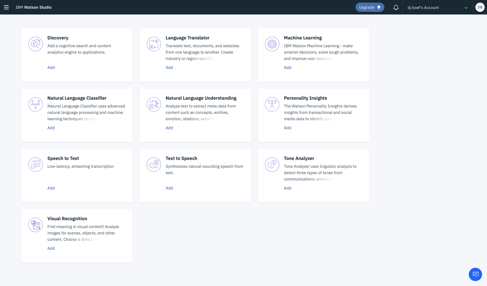
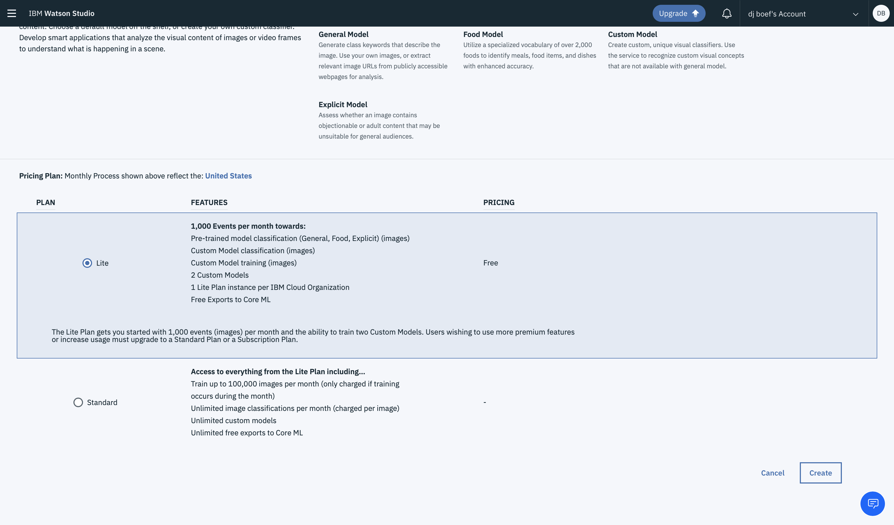

*Quick links :*
[Home](/README.md) - [WildFires](WILDFIRES.md) - [**Watson Studio**](STUDIO.md) - [Visual Recognition Model](VISRECO.md) - [Test and Deploy](VRMTEST.md)
***

# Watson Studio Set up and Configuration in IBM Cloud

## Lab Objectives

In this lab you will set up Watson Studio with a new Project.  You will learn:

- Watson Studio
- How to set up a new Watson Studio Project

### Introduction

Watson Studio accelerates the machine and deep learning workflows required to infuse AI into your business to drive innovation. It provides a suite of tools for data scientists, application developers and subject matter experts, allowing them to collaboratively connect to data, wrangle that data and use it to build, train and deploy models at scale. Successful AI projects require a combination of algorithms + data + team, and a very powerful compute infrastructure.

- Learn more from the Experts - [Introducing IBM Watson Studio](https://medium.com/ibm-watson/introducing-ibm-watson-studio-e93638f0bb47)

### Watson Studio Setup

#### Create **Cloud Object Storage**

- Create a Cloud Object Storage instance by visiting the [IBM Cloud Catalog](https://console.bluemix.net/catalog/?search=object)
- Search on **Object** in the IBM Cloud Catalog or go to the **Storage section** in the left menu.
- Click on the **Object Storage** service tile

- Click on the **Create** button

#### Create a Watson Studio service instance

- Go back to the IBM Cloud Catalog
- Search on **Studio** in the IBM Cloud Catalog or go to the **AI section** in the left menu.

- Click on the **Watson Studio** service tile

- Click on the **Create** button
- After the Watson Studio service is created, click on **Get Started** or visit Watson Studio at <https://dataplatform.cloud.ibm.com/>

- (If needed) Login with your IBM Cloud account
- Walk through the introductory tutorial to learn about Watson Studio

### Watson Studio Projects

Projects are your workspace to organize your resources, such as assets like data, collaborators, and analytic tools like notebooks and models

#### Create a New Project

- Click on **Create a project**
- Click on **Create an empty project**
- Give your Project a name : **Wildfire Burned Homes**. A description is optional.
- The Cloud Object Storage instance created in an earlier step should be prefilled
- Click on **Create**

Your project needs to be associated with a Watson Visual Recognition Service instance
- Now add the Visual recognition service to the project: click on **Settings**
- Scroll down to **Associated services** and click on **Add service**
- From the menu, select Watson. An overview of Watson services will appear.

- Select the **Visual Recognition** tile and press the **Create** button, select a region in the next screen and click **Confirm**
Scroll down to **Associated services** you will see the Watson Visual Recognition added to your project.

You are ready to set up your Project with Watson Visual Recognition. Proceed to the next [step](VISRECO.md)

***
*Quick links :*
[Home](/README.md) - [WildFires](WILDFIRES.md) - [**Watson Studio**](STUDIO.md) - [Visual Recognition Model](VISRECO.md) - [Test and Deploy](VRMTEST.md)
